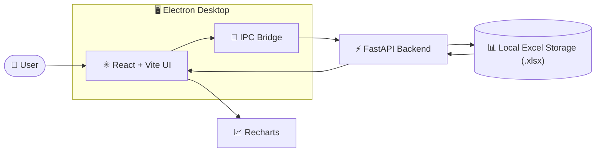
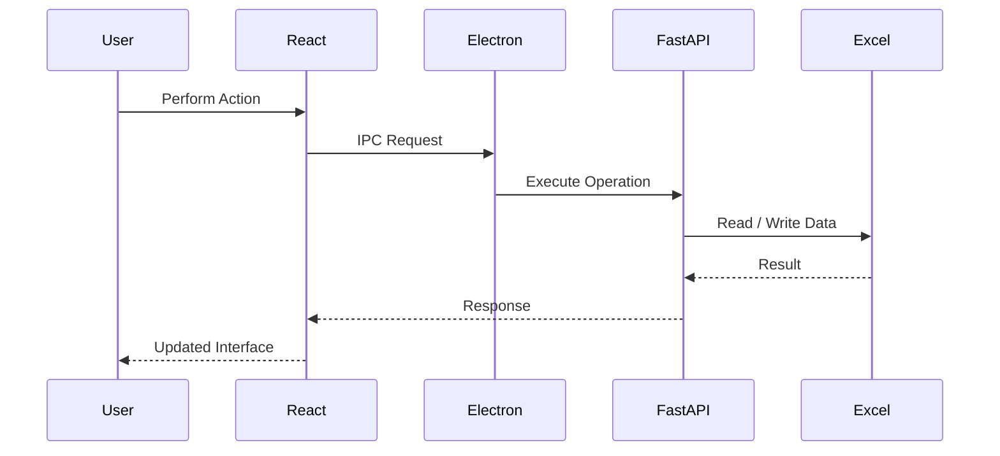

<!-- ========================================================= -->
<!--                       FINLEDGE HERO                       -->
<!-- ========================================================= -->

<p align="center">
  
</p>

<h1 align="center">FinLedge</h1>

<p align="center">
  <strong>Desktop-first Personal Finance Management Application</strong>
</p>

<p align="center">
Manage banking, investments, and personal finances in one place while keeping your data stored locally.
</p>

<p align="center">


<!--  -->


</p>

<p align="center">

<a href="https://github.com/sachinadk2011/FinLedge-App/releases/latest">

</a>

<a href="#-installation">

</a>

<a href="#-screenshots">

</a>

</p>

---

# Overview

FinLedge is a **desktop-first personal finance management application** designed to help users organize their financial activities without relying on cloud services.

Instead of storing sensitive financial information on external servers, FinLedge keeps everything **locally on your computer**, giving you complete ownership of your data while providing a modern desktop experience.

Whether you're tracking banking services, managing stock investments, monitoring daily expenses, or reviewing financial summaries, FinLedge brings everything together in a single application.

---

# Why FinLedge?

| | |
|---|---|
| 🖥 **Desktop First** | Native desktop experience built with Electron. |
| 🔒 **Local First** | Your financial data stays on your own computer. |
| 📄 **Excel-Based Storage** | Data is stored in readable and portable `.xlsx` files. |
| 🚫 **No Account Required** | No sign-up, login, or cloud dependency. |
| 📊 **Financial Insights** | Analyze finances using dashboards and visual summaries. |
| 🛠 **Open Source** | Transparent development with versioned releases. |

---

# Current Status

| Status | Value |
|--------|-------|
| Development | ✅ Active |
| Latest Version | **v1.2.0** |
| Platform | Windows Desktop |
| License | MIT |
| Storage | Local Excel Files |
| Update Method | In-app notification → GitHub Releases |


<!-- ========================================================= -->
<!--                 APPLICATION PREVIEW                       -->
<!-- ========================================================= -->

# 📸 Application Preview

Explore FinLedge through the screenshots below. Each module is designed to provide a focused and intuitive financial management experience while keeping all data securely stored on your local device.

---

## 🏠 Home

The Home page serves as the central navigation hub of FinLedge, providing quick access to all financial modules and core application features through an intuitive card-based interface.

<p align="center">
  
</p>

**Highlights**

- Central navigation hub
- Quick access to all financial modules
- Clean card-based interface
- Local-first desktop experience
- Entry point to the entire application
---

## 🏦 Bank Services

Manage bank-related expenses, service charges, investment costs, and transaction history from a dedicated workspace.

<p align="center">
  
</p>
<p align="center">
  
</p>

<p align="center">
  
</p>

**Highlights**

- Bank transaction management
- Service & maintenance costs
- Investment-related expenses
- Interactive dashboard & analytics
- Category breakdown and transaction history

---

## 📈 Share Portfolio

Track stock investments, portfolio performance, transaction history, and investment analytics in one place.

<p align="center">
  
</p>
<p align="center">
  
</p>

<p align="center">
  
</p>
<p align="center">
  
</p>

**Highlights**

- Share transaction management
- Portfolio overview
- Category-wise investment analysis
- Interactive charts
- IPO tracking & transaction history

---

## 💰 Personal Finance

Monitor and manage both cash and bank transactions with a unified financial dashboard.

<p align="center">
  
</p>
<p align="center">
  
</p>

<p align="center">
  
</p>

**Highlights**

- Cash & bank transaction management
- Unified financial dashboard
- Category-wise analysis
- Combined transaction history
- Interactive charts

---

## 📊 Financial Summary

Analyze your financial performance through consolidated reports, charts, and statistical summaries.

<p align="center">
  
</p>
<p align="center">
  
</p>

**Highlights**

- Financial overview
- Income & expense summaries
- Interactive analytics
- Visual reports & insights

---

## ⚙️ Settings

Configure application preferences, manage data, import/export financial records, and stay informed about new releases.

<p align="center">
  
</p>

**Highlights**

- Application preferences
- Import & Export
- Update notifications
- Data management
- About FinLedge

---

## ✨ Key Capabilities

✔ Local-first finance tracking

✔ Excel-based storage

✔ Modular architecture

✔ Interactive analytics

✔ Data migration

✔ Import / Export

✔ Automatic release workflow

✔ In-app update notification


# 🚀 What's New in v1.2.0

| Feature | Description |
|----------|-------------|
| 💰 Personal Finance | New module for managing personal financial records. |
| 🏦 Bank Flow | Track transactions performed through bank accounts. |
| 💵 Cash Flow | Monitor cash-based income and expenses. |
| 📊 Financial Overview | Unified financial insights across different modules. |
| 🔄 Data Migration | Automatically migrate legacy bank data to the new structure. |
| 💾 Backup Protection | Backup existing data before migration. |
| 📂 Import & Export | Merge or replace existing financial data. |
| 🏦 Redesigned Bank Services | Improved categorization and organization. |
| ⚙ Settings Module | Centralized application configuration and data management. |
| 🧹 Internal Improvements | Better project structure, validation, and maintainability. |

---

> **Note**
>
> FinLedge follows a **desktop-first, local-first philosophy**. All financial records remain on your own device, and application updates are delivered through an in-app notification that redirects users to the official GitHub Releases page for downloading the latest version.

---

<!-- ========================================================= -->
<!--                UNDERSTANDING FINLEDGE                     -->
<!-- ========================================================= -->

# 🏗️ System Architecture

FinLedge follows a **desktop-first, local-first architecture**, where the user interface, desktop runtime, backend services, and local data storage are separated into independent layers.



### Architecture Overview

- **Electron** provides the desktop runtime and launches the local backend.
- **React + Vite** powers the modern desktop interface.
- **FastAPI** handles business logic, calculations, and data processing.
- **Excel workbooks** serve as the local database, keeping all financial records on the user's device.
- **Recharts** generates interactive dashboards and financial visualizations.
- Communication between the frontend and backend occurs locally through Electron, ensuring responsive performance without requiring cloud services.

> **Design Philosophy**
>
> FinLedge is designed around a **local-first architecture**, meaning all financial data remains on the user's device. No external database or internet connection is required for core functionality.

## 🔄 Request Flow



# ⚙ Technology Stack

| Category | Technology |
|-----------|------------|
| Frontend | React + Vite |
| Desktop Runtime | Electron |
| Backend | FastAPI |
| Programming Language | Python |
| Data Storage | Microsoft Excel (.xlsx) |
| Charts | Recharts  |
| Build Tools | Electron Builder, PyInstaller |
| Automation | GitHub Actions |
| Version Control | Git & GitHub |

---

# 🧩 Core Modules

FinLedge is organized into independent modules, allowing each feature to evolve without affecting the overall application.

| Module | Purpose |
|---------|---------|
| 🏠 Home | Overview and quick navigation |
| 🏦 Bank Services | Manage banking-related transactions and services |
| 📈 Share Portfolio | Track investment activities and portfolio records |
| 💰 Personal Finance | Record and monitor bank flow, cash flow, and daily finances |
| 📊 Financial Summary | Visual dashboards and financial insights |
| ⚙ Settings | Application configuration, migration, backup, import, and export |

---

# 🔄 How FinLedge Works

```text
Launch Application
        │
        ▼
Choose Module
        │
        ▼
Manage Financial Records
        │
        ▼
Data Validation
        │
        ▼
Save to Local Excel Files
        │
        ▼
Generate Dashboards & Reports
```

Every transaction remains stored locally and is immediately available across the application's dashboards and reporting features.

---

# 📂 Project Structure

```text
FinLedge-App
│
├── backend/                 # FastAPI backend services
│
├── frontendwebapp/          # React + Vite frontend
│
├── desktop/                 # Electron desktop application
│
├── scripts/                 # Release & development automation
│
├── .github/
│   └── workflows/           # GitHub Actions workflows
│
├── assets/
│   ├── logo/
│   └── readme/
│
├── requirements.txt
│
├── setup_venv.ps1
│
└── README.md
```

---

# 📁 Repository Organization

| Directory | Description |
|------------|-------------|
| backend | Backend APIs and business logic |
| frontendwebapp | User interface built with React |
| desktop | Electron desktop runtime |
| scripts | Version management and release automation |
| .github/workflows | Automated build and release pipelines |
| assets | Logos, screenshots, and README resources |

---

# 👥 Who Is FinLedge For?

| User | Benefit |
|------|---------|
| 👤 Individuals | Track personal finances while keeping data local |
| 📈 Investors | Manage stock transactions and investment history |
| 🎓 Students | Learn desktop application architecture using React, Electron, and FastAPI |
| 👨‍💻 Developers | Explore a modular desktop application with automated release workflows |

---

# 💡 Design Principles

FinLedge is built around a small set of guiding principles that influence every feature and release.

| Principle | Description |
|------------|-------------|
| 🖥 Desktop First | Designed as a native desktop application rather than a web application wrapped for desktop. |
| 🔒 Local First | Financial records remain on the user's device. |
| 📄 Human Readable Data | Data is stored in Excel files for transparency and portability. |
| 🔄 Backward Compatibility | New releases aim to preserve existing user data whenever possible. |
| 🧩 Modular Architecture | Features are developed independently to improve maintainability. |
| 🚀 Continuous Improvement | Incremental releases deliver new capabilities while improving stability. |

---

# 📈 Project Evolution

FinLedge has continuously evolved through multiple releases, expanding from a basic finance tracker into a more complete personal finance platform.

| Version | Major Milestone |
|----------|-----------------|
| **v1.0.0** | Initial desktop finance tracking application |
| **v1.0.1** | Stability improvements through codebase refinement |
| **v1.0.2** | Improved update management |
| **v1.0.3** | Introduced update notification panel, version synchronization, and release automation |
| **v1.1.0** | Added GitHub Actions release workflow and automated version management |
| **v1.2.0** | Introduced Personal Finance, migration engine, redesigned Bank Services, and improved data management |

---

# 🗺️ Roadmap

The roadmap below reflects the planned direction for FinLedge. Features may evolve as the project grows, but the current vision is outlined here.

---

## ✅ Completed (v1.2.0)

- Redesigned **Bank Services** categories with automatic legacy data migration
- Introduced **Personal Finance** with Bank Flow, Cash Flow, and Combined Overview
- Added live, read-only Bank Flow integration from Bank Services and Share Portfolio
- Redesigned **Financial Summary** into four dedicated analytics sections
- Added Import / Export with Merge & Replace modes
- Redesigned Settings module
- Improved project architecture and release tooling

---

## 🚧 In Progress

- Release signing infrastructure
  - GitHub Actions workflow completed
  - SignPath integration prepared
  - Official code signing will be enabled once the project meets SignPath Foundation eligibility requirements

---

## 🔭 Planned — v1.3.0

- Opportunity Cost Engine
- Bank Interest Rate Settings
- Real / Actual Profit Calculation
- Daily Interest Simulation (based on daily closing balances)

---

## 🚀 Planned — v2.0.0

- Google Sign-In
- Google Drive Synchronization
- Automatic Conflict Resolution
- Cross-Platform Desktop Support
- Android Application Support

---

> **Note**
>
> The roadmap represents the current development direction. Features and priorities may evolve as FinLedge continues to mature.

<!-- ========================================================= -->
<!--                 INSTALLATION & DEVELOPMENT                -->
<!-- ========================================================= -->

# 🚀 Getting Started

Choose the setup method that best matches your needs.

| I want to... | Recommended Guide |
|--------------|------------------|
| 📦 Use FinLedge | Download the latest installer from the GitHub Releases page |
| 👨‍💻 Contribute or modify the source code | Follow the Developer Setup below |

---

# 📥 Installation (End Users)

The easiest way to install FinLedge is through the latest GitHub Release.

1. Visit the **Latest Release** page.
2. Download the latest Windows installer.
3. Run the installer.
4. Launch FinLedge from the Start Menu or Desktop shortcut.

> **Note**
>
> FinLedge currently provides an in-app update notification. When a newer version is available, the application will direct you to the official GitHub Releases page to download the latest installer.

# 👨‍💻 Developer Setup

FinLedge is designed with a **root-first workflow**, meaning almost every development task can be performed directly from the project root without navigating into individual project folders.

---

## Prerequisites

Install the following software before setting up the project.

| Software | Version |
| :--- | :--- |
| Git | Latest |
| Node.js | 22 LTS |
| Python | 3.12 |
| PowerShell | 7+ (Recommended) |

---

## Clone the Repository

```bash
git clone https://github.com/sachinadk2011/FinLedge-App.git
cd FinLedge-App
```

---

# ⚡ Quick Setup (Recommended)

The fastest way to prepare the development environment is by using the built-in setup script.

```powershell
.\setup_venv.ps1
```

### The setup script automatically

| ✓ | Action |
|:-:|---------|
| ✅ | Creates a Python virtual environment if one doesn't exist |
| ✅ | Reuses an existing virtual environment |
| ✅ | Upgrades `pip` to the latest version |
| ✅ | Installs missing Python dependencies |
| ✅ | Synchronizes installed packages with `requirements.txt` |
| ✅ | Keeps the virtual environment and dependency list in sync |

> **Recommended:** This is the preferred setup method for all contributors.

---

<details>

<summary><strong>🔧 Manual Python Setup (Optional)</strong></summary>

If you prefer managing your Python environment manually:

```bash
python -m venv venv

venv\Scripts\activate

python -m pip install --upgrade pip

pip install -r requirements.txt
```

</details>

---

# 📦 Install JavaScript Dependencies

Install all JavaScript dependencies from the project root.

```bash
npm install

npm install --prefix frontendwebapp

npm install --prefix desktop
```

> This only needs to be performed once or whenever project dependencies change.

---

# 🛠 Development Commands

### Run the Project

| Purpose | Command |
| :--- | :--- |
| Start Backend + Frontend (Web Development) | `npm run dev` |
| Start Electron Desktop Application | `npm run desktop-dev` |

---

### Build

| Purpose | Command |
| :--- | :--- |
| Build Desktop Application | `npm run desktop-build` |

---

### Database & Migration

| Purpose | Command |
| :--- | :--- |
| Preview Data Migration | `npm run migrate:preview` |
| Apply Data Migration | `npm run migrate:apply` |

---

### Version Management

| Purpose | Command |
| :--- | :--- |
| Synchronize Project Versions | `npm run version:sync` |
| Update the project to a new version | `npm run version:sync -- <version>` |
---

### Release Management

| Purpose | Command |
| :--- | :--- |
| Create a New Release | `npm run release` |
| Force Recreate an Existing Tag | `npm run release -- <tag> force` |

> Example:
>
> ```bash
> npm run release -- v1.2.0 force
> ```

---

### Development Utilities

| Purpose | Command |
| :--- | :--- |
| Simulate Update Notification | `npm run simulate-update` |

---

# 📁 Important Project Files

| File / Directory | Purpose |
| :--- | :--- |
| `setup_venv.ps1` | Automated Python environment setup |
| `requirements.txt` | Python dependencies |
| `package.json` | Root development commands |
| `scripts/` | Build, migration, versioning and release automation |
| `.github/workflows/` | GitHub Actions CI/CD workflows |
| `desktop/` | Electron desktop application |
| `frontendwebapp/` | React frontend |
| `backend/` | FastAPI backend |

---

> 💡 **Developer Experience**
>
> FinLedge centralizes development tasks through the root `package.json`. Running, building, migrating data, synchronizing versions, and creating releases can all be performed from the project root, providing a simpler and more consistent development workflow.

<!-- ========================================================= -->
<!--                  RELEASE & AUTOMATION                     -->
<!-- ========================================================= -->

# 🚀 Release & Automation

FinLedge includes a release automation pipeline that streamlines the process of preparing, building, and publishing desktop releases. Once a release is initiated, the workflow handles the remaining steps automatically, helping maintain consistent versioning and release artifacts.

---

# 🔄 Release Pipeline

The release lifecycle follows the workflow below.

```text
Developer
      │
      ▼
Update Project Version
      │
      ▼
Create Release
      │
      ▼
GitHub Tag
      │
      ▼
GitHub Actions
      │
      ▼
Build Desktop Application
      │
      ▼
Generate Release Assets
      │
      ▼
Publish GitHub Release
      │
      ▼
Users Download Latest Version
```

---

# ⚙ GitHub Actions Workflow

Whenever a version tag matching the format below is pushed,

```text
v*.*.*
```

GitHub Actions automatically starts the Windows release pipeline.

### Pipeline Responsibilities

| Stage | Description |
| :--- | :--- |
| 📥 Checkout | Retrieves the latest project source code |
| 🟢 Environment Setup | Installs the required Node.js and Python environments |
| 📦 Dependency Installation | Restores JavaScript and Python dependencies |
| 🏗 Build | Generates the production Electron application |
| 📁 Release Assets | Creates the installer and release metadata |
| 🚀 Publish | Creates a GitHub Release and uploads all generated assets |

The entire release process is automated after a valid version tag is pushed.

---

# 📦 Published Release Assets

Each GitHub Release contains the following artifacts.

| Asset | Purpose |
| :--- | :--- |
| `FinLedge-Setup-*.exe` | Windows installer |
| `latest.yml` | Release metadata used by the application |
| `*.blockmap` | Installer metadata generated by Electron Builder |

---

# 📂 Release Architecture

FinLedge organizes release-related logic into dedicated scripts to keep the release process modular and maintainable.

| Component | Responsibility |
| :--- | :--- |
| `scripts/finledge.mjs` | Central command entry point for development and desktop builds |
| `scripts/start-release.mjs` | Creates release tags and starts the release workflow |
| `scripts/sync-version.mjs` | Synchronizes project version information |
| `scripts/verify-version.mjs` | Validates version consistency before release |
| `scripts/refresh-latest-yml.mjs` | Updates release metadata |
| `.github/workflows/release.yml` | Automated Windows release pipeline |

---

# 🔔 Update Delivery

FinLedge **does not automatically download or install updates**.

Instead, the application periodically checks for newer releases. When an update is available, users are notified through an in-app update panel, which redirects them to the project's **GitHub Releases** page to download the latest installer manually.

This approach gives users full control over when and how updates are installed.

---

# 🛡 Code Signing

The repository includes a prepared SignPath integration and code-signing workflow for future use.

Although the infrastructure has already been implemented, **official code signing is currently disabled** because the project does not yet satisfy the eligibility requirements for the SignPath Foundation program.

The absence of code signing does **not** affect the automated build and release pipeline.

---

# 💡 Engineering Principles

The release system was designed with maintainability and consistency in mind.

- ✅ Root-first development workflow
- ✅ Automated Windows release pipeline
- ✅ Consistent project versioning
- ✅ Modular release scripts
- ✅ Repeatable build process
- ✅ Local-first desktop application
- ✅ GitHub Releases as the official distribution channel

---

> **Developer Note**
>
> FinLedge separates development, version management, build automation, and release publishing into independent components. This modular approach simplifies maintenance, reduces manual work, and helps ensure every public release follows the same repeatable process.

<!-- ========================================================= -->
<!--                    RELEASE JOURNEY                        -->
<!-- ========================================================= -->

# 📜 Release Journey

FinLedge has continuously evolved through incremental releases focused on improving usability, maintainability, and the overall development workflow.

| Version | Release Highlights |
| :--- | :--- |
| **v1.0.0** | Initial desktop release with local-first financial management, Electron + React + FastAPI architecture, and Excel-based storage. |
| **v1.0.1** | Internal refactoring rollback to improve project stability and maintain a reliable codebase. |
| **v1.0.2** | Minor improvements to the update management workflow. |
| **v1.0.3** | Introduced the in-app **Update Notice** panel, centralized version synchronization, release automation scripts, and a streamlined terminal-based release process. |
| **v1.1.0** | Implemented GitHub Actions release automation, standardized version management, improved release workflows, and prepared the infrastructure for future code signing with SignPath. |
| **v1.2.0** | Major feature update introducing the redesigned **Bank Services**, the new **Personal Finance** module, Financial Summary redesign, data migration system, Import/Export improvements, enhanced Settings, and numerous UI/UX refinements. |

---

## 📈 Project Evolution

```text
v1.0.0
   │
   ├── Foundation
   │
v1.0.3
   │
   ├── Update System
   ├── Release Automation
   │
v1.1.0
   │
   ├── GitHub Actions
   ├── Version Management
   │
v1.2.0
   │
   ├── Personal Finance
   ├── Data Migration
   ├── Financial Summary
   └── Bank Services Redesign
```

---

> Every release aims to improve both the end-user experience and the project's engineering quality through continuous refinement, automation, and maintainable architecture.

<!-- ========================================================= -->
<!--                     CONTRIBUTING                          -->
<!-- ========================================================= -->

# 🤝 Contributing

Contributions, bug reports, feature suggestions, and discussions are always welcome.

If you would like to contribute:

1. Fork the repository.
2. Create a feature branch.
3. Make your changes.
4. Test your changes.
5. Open a Pull Request with a clear description.

Before submitting a contribution, please ensure:

- The project builds successfully.
- Existing functionality is not broken.
- New features follow the existing project structure.
- Commit messages are descriptive.

If you're unsure where to begin, feel free to open an Issue to discuss ideas before starting development.

Thank you for helping improve FinLedge!

<!-- ========================================================= -->
<!--                       LICENSE                             -->
<!-- ========================================================= -->

# 📄 License

This project is licensed under the **MIT License**.

See the [LICENSE](LICENSE) file for complete license information.

<!-- ========================================================= -->
<!--                  ACKNOWLEDGEMENTS                         -->
<!-- ========================================================= -->

# 🙏 Acknowledgements

FinLedge is an independent software project **conceived, designed, architected, and maintained by Sachin Adhikari**.

The overall product vision, application architecture, feature planning, development roadmap, engineering decisions, release strategy, testing oversight, and final implementation approval are directed by the project author.

Throughout the development of FinLedge, AI-assisted development tools were used to accelerate implementation, debugging, testing, documentation, and engineering workflows.

## AI Development Contributors

| Tool | Primary Contribution |
| :--- | :--- |
| **OpenAI Codex** | The primary AI development assistant during the early stages of FinLedge. Contributed significantly to the implementation of the application's core functionality and major engineering work from building the initial prototype to the current version. |
| **Antigravity** | The second major development assistant. Beginning after **v1.0.3**, it became involved in every subsequent release, assisting with feature implementation, UI development, engineering improvements, debugging, regression testing, and validation. In addition to the author's own testing, Antigravity was frequently used to identify issues and edge cases that might otherwise have been overlooked. |
| **ChatGPT** | Assisted throughout the project with software architecture discussions, feature planning, technical research, documentation, release planning, engineering reviews, and problem-solving. |
| **Claude** | Contributed implementation ideas, alternative technical approaches, code reviews, and engineering discussions during development. |
| **OpenCode** | Assisted with project planning and engineering documentation, including maintaining development documents such as `plan.md`, `task.md`, `codebase.md`, and `agent.md`, which support the overall development workflow. |
| **Cursor** | Used primarily for code refinement, editor-assisted development, and smaller implementation improvements during later releases, particularly throughout the v1.2.0 development cycle. |

---

## Open Source Technologies

FinLedge is built upon several outstanding open-source technologies, including:

- Electron
- React
- Vite
- FastAPI
- Recharts
- OpenPyXL
- Node.js
- GitHub Actions

Special thanks to the maintainers and contributors of these projects for providing the tools and ecosystems that make applications like FinLedge possible.

---

> **Author's Note**
>
> AI-assisted development played an important role in accelerating the implementation of FinLedge. However, the product vision, software architecture, project planning, feature design, engineering decisions, testing strategy, release management, and final review of every change remain the responsibility of the project author, **Sachin Adhikari**.

<!-- ========================================================= -->
<!--                        SUPPORT                            -->
<!-- ========================================================= -->

# ⭐ Support the Project

If you find FinLedge useful, consider supporting the project by:

- ⭐ Starring this repository
- 🐛 Reporting bugs
- 💡 Suggesting new features
- 🤝 Contributing improvements
- 📢 Sharing the project with others

Every contribution—big or small—helps FinLedge continue to grow.
